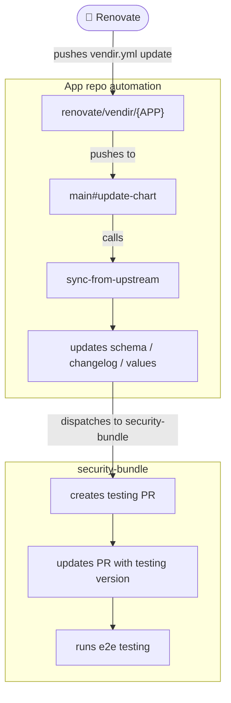

# Automated Chart Updates (simplified)

A high-level view of how an upstream bump flows from Renovate into a testing PR on
`security-bundle`. For the full version with every workflow, see
[automated-chart-updates.md](./automated-chart-updates.md).

