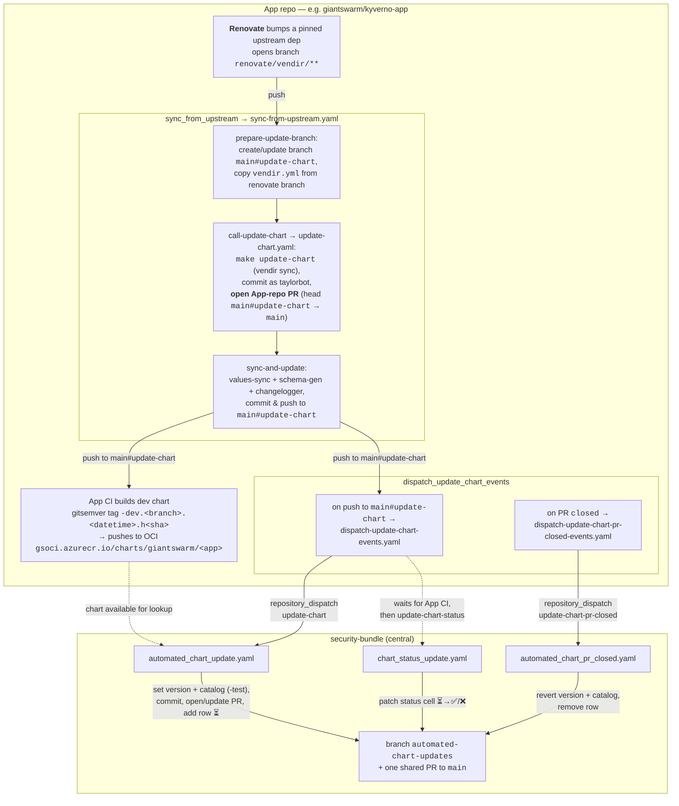
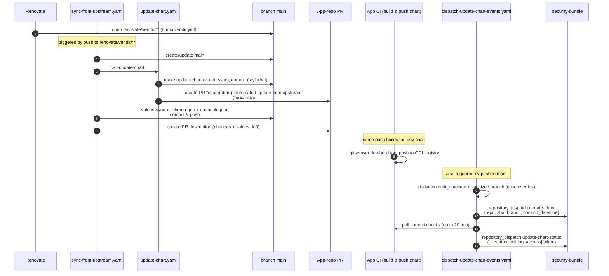
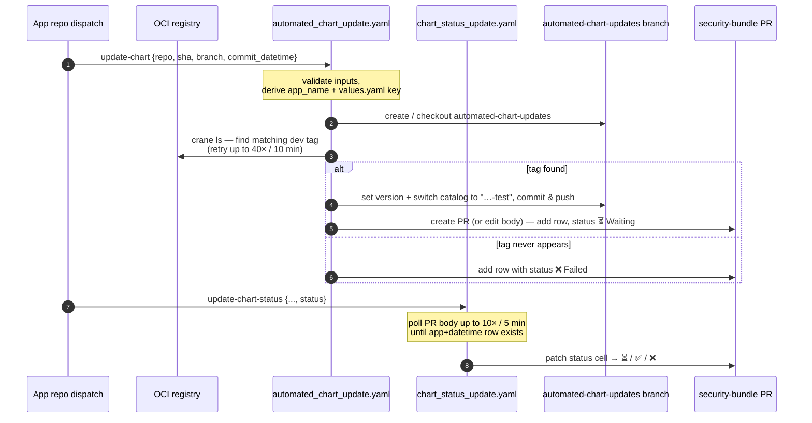
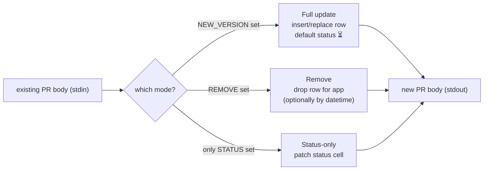
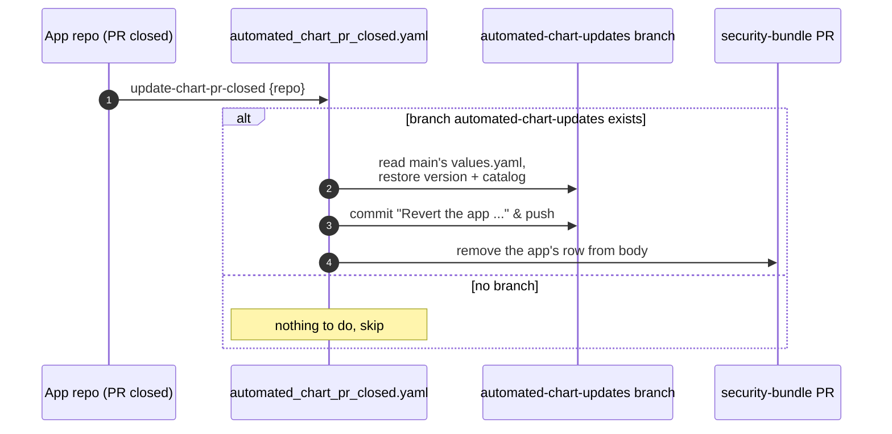

# Automated Chart Updates

How an upstream dependency bump in an App repo (e.g. `giantswarm/kyverno-app`) is turned
into a dev-build, opened as an "automated update" PR in that App repo, and then
propagated into a single shared testing PR on `security-bundle` — kept in sync as CI
runs and torn down when the App-repo PR closes.

## Participating workflows

**App repo** (per-app, generated by `devctl` — `zz_generated.*`), each just calls a
reusable workflow in [`giantswarm/github-workflows`](https://github.com/giantswarm/github-workflows):

| App-repo workflow                              | Calls reusable workflow                        | Trigger                                   |
| ---------------------------------------------- | ---------------------------------------------- | ----------------------------------------- |
| `zz_generated.sync_from_upstream.yaml`         | `sync-from-upstream.yaml`                       | push to `renovate/vendir/**`              |
| `zz_generated.update_chart.yaml`               | `update-chart.yaml`                             | push to `main#update-chart` / `workflow_call` |
| `zz_generated.dispatch_update_chart_events.yaml` | `dispatch-update-chart-events.yaml` / `dispatch-update-chart-pr-closed-events.yaml` | push to `main#update-chart`; PR `closed` |

**`security-bundle`** (central — handles the three `repository_dispatch` events):

| Dispatch event           | Workflow                          | Purpose                                                  |
| ------------------------ | --------------------------------- | -------------------------------------------------------- |
| `update-chart`           | `automated_chart_update.yaml`     | Point `values.yaml` at the new dev-build; open/update the shared PR |
| `update-chart-status`    | `chart_status_update.yaml`        | Patch the per-app status cell (⏳ / ✅ / ❌) in the PR body |
| `update-chart-pr-closed` | `automated_chart_pr_closed.yaml`  | Revert the app and drop its row when the App-repo PR closes |

The central PR body table is maintained by `hack/update_pr_body.py`. All workflows
authenticate as the **`HeraldBot[bot]`** GitHub App (`HERALD_CLIENT_ID` / `HERALD_APP_KEY`);
the App-repo PR itself is pushed by `taylorbot` (`TAYLORBOT_GITHUB_ACTION`).

---

## 1. End-to-end overview

---

## 2. App-repo side — from Renovate to the dispatch

Key points on the App side:

- **Two branches.** Renovate's `renovate/vendir/**` branch is only the *trigger*. The
  actual update happens on a dedicated `main#update-chart` branch, and the App-repo PR is
  opened from `main#update-chart` → `main`. (The `#` lets `update-chart.yaml` derive the
  base branch as `main`.)
- **The dev chart is built by normal App CI** on the push to `main#update-chart`, tagged
  with a gitsemver dev-build version and pushed to
  `gsoci.azurecr.io/charts/giantswarm/<app>`.
- **The dispatch workflow waits** for the App's CI checks (default 20 min) before sending
  `update-chart-status`, so the central PR reflects whether the dev build actually passed.

---

## 3. security-bundle side — the shared testing PR

Every app's dispatch converges on the single `automated-chart-updates` branch and the one
PR opened from it (`test(apps): [DO NOT MERGE] Update apps testing versions`). The PR body
holds one table row per app/build.

Key points on the central side:

- **Catalog is switched to `-test`** so the bundle pulls the dev chart, not the released one.
- **Tag resolution is best-effort:** waits up to 10 min for the dev tag to appear in OCI,
  matching the `branch.datetime` suffix, falling back to the short-SHA suffix.
- **The PR is shared** across all apps; rows are added, status-patched, and removed
  independently per app.

### PR body modes (`hack/update_pr_body.py`)

---

## 4. Cleanup — App-repo PR closed

When the `main#update-chart` PR in the App repo is closed (merged or abandoned),
`dispatch-update-chart-pr-closed-events.yaml` fires and dispatches `update-chart-pr-closed`
to security-bundle, which undoes just that app's entry.

There is no auto-close step on the central PR — once the table is empty (or testing is
done), it is merged or closed manually.

---

## Notes

- App-repo workflows are `devctl`-generated (`zz_generated.*`) and only call the reusable
  workflows in `giantswarm/github-workflows`; the real logic lives there.
- All three central workflows also support manual `workflow_dispatch` with the same inputs,
  useful for replaying or debugging a single app.
